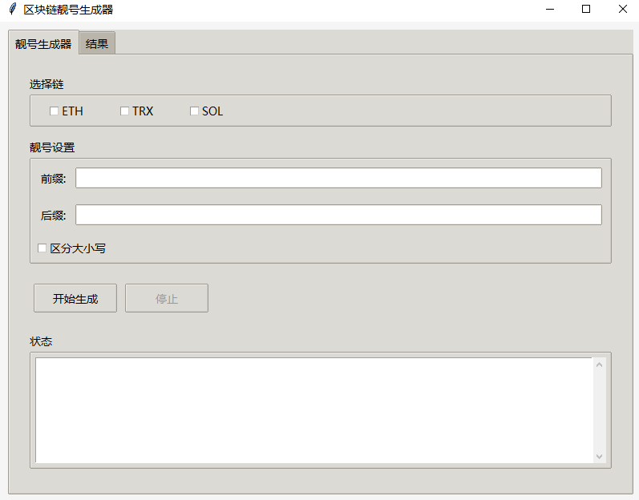

# 区块链靓号生成器

这是一个轻量级的区块链靓号地址生成工具，支持ETH、TRX、SOL三种主流链。您可以通过简洁的图形界面设置靓号的前缀和后缀，实时监控生成速度，并在找到靓号时获得即时提醒。

## 软件界面

## 功能特点

- **多链支持**: 同时支持以太坊(ETH)、波场(TRX)和索拉纳(SOL)
- **自定义靓号规则**: 可自由设置地址前缀和后缀
- **大小写敏感选项**: 根据需要选择是否区分大小写
- **实时状态显示**: 查看当前生成速度和进度
- **自动保存结果**: 找到的靓号将自动保存到本地文件
- **结果导出功能**: 方便导出所有找到的靓号

## 使用方法

1. **选择链类型**
   - 在"选择链"区域勾选您想要生成的区块链类型(ETH/TRX/SOL)
   - 可以同时选择多个链

2. **设置靓号参数**
   - 在"前缀"输入框中填写您希望的地址前缀
   - 在"后缀"输入框中填写您希望的地址后缀
   - 如需区分大小写，请勾选"区分大小写"选项

3. **开始生成**
   - 点击"开始生成"按钮启动生成过程
   - 生成过程中可在状态区域查看实时速度和进度
   - 需要停止时点击"停止"按钮

4. **查看结果**
   - 切换到"结果"标签页查看所有找到的靓号
   - 使用"清除结果"按钮可清空结果列表
   - 使用"导出结果"按钮可将结果保存为文本文件

## 注意事项

- 生成速度受计算机性能影响，高性能计算机可获得更快的生成速度
- 设置复杂的前后缀将增加找到靓号的难度和时间
- 建议在离线环境运行以提高安全性 